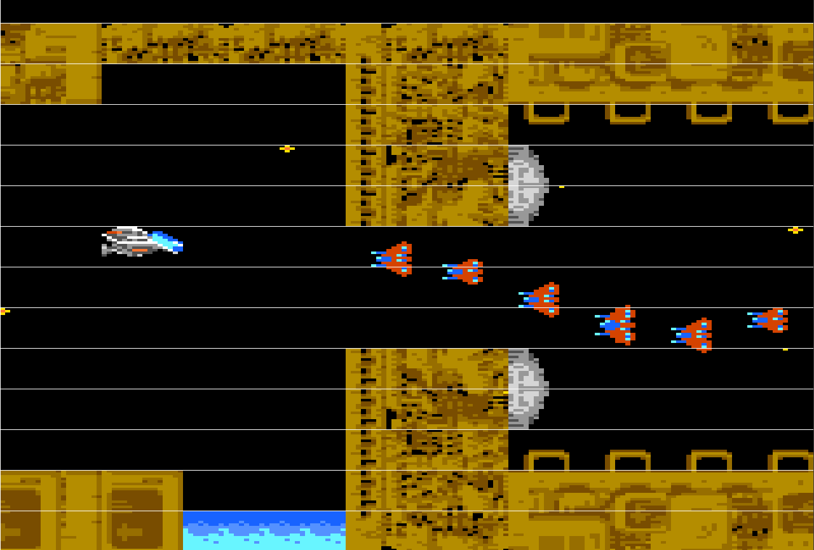
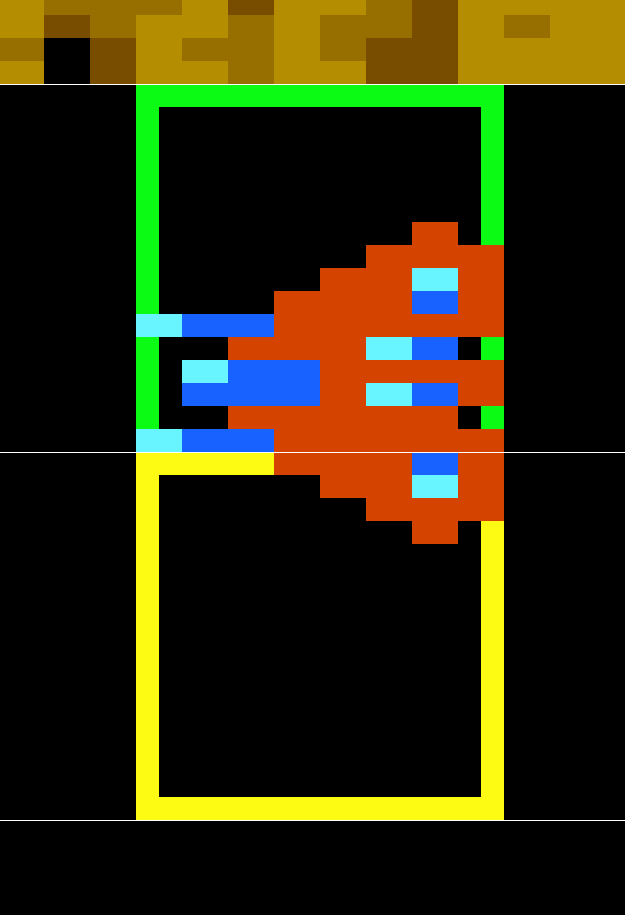

# Understanding the Display List List (DLL)

The 7800 ProSystem has an unusual way of handling animation. It does so through a Display List List, also called DLL. cc7800 hides all this complexity by managing the DLL through its functions defined in `multisprite.h`. It might however be useful to understand how the DLL works when trying to push the limits of the 7800 ProSystem.

The DLL is a list of lists which contains all the graphical resources that will be displayed on the screen:

- The screen is divided in horizontal zones, typically 16 or 8 pixels, but can be lower if need be. The DLL is the top list which has one list entry for each horizontal zone.
- Each sublist contains all the graphical resources which need to be displayed in its associated horizontal zone. The order in that sublist determines which resources are drawn first, the last ones being drawn on top of the previous sprites if need be
- A sublist can contain either one or more tilemaps (which will be aligned with the zone) and/or sprites
- Sprites need to be as tall as the zone. So in a 16-pixel high horizontal zone, all sprites need to be 16 pixels and

This last point is specific to the 7800 and has a lot of implication. Namely, a sprite across two horizontal zones need to have two entries - one for each sublist.

Here is a screenshot from [example_RType2.c](../examples/example_RType2.c), with the horizontal zones added:

Because the first enemy is spread across two zones, two sprites need to be defined. One for the upper zone (outlined in green) and one for the lower zone (oulined in yellow). Both will be defined as a 8x16 sprite with enough empty space above and below to exactly fit the horizontal zone - hence the concept of [HoleyDMA](graphical_resources.md) to save some space in memory.

