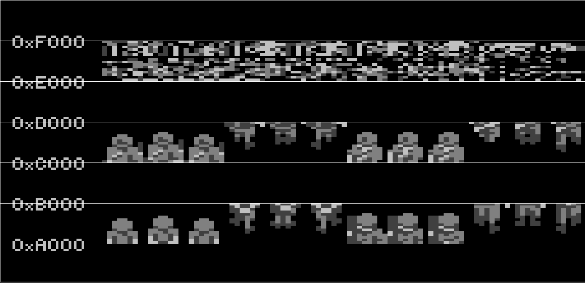

# Graphical Resources

cc7800 by default is using the 160A mode, where the resolution is 160x240 (wide pixels) and each sprite has three colors.

Graphical resources are generated the following way:

- Create the resources in your favorite image editor (IMPORTANT: if using the 160 mode, they still need to be in 320 format)
- Generate a `.yaml` file which describe sprites in the images (see the [sprite7800 documentation](https://github.com/steux/tools7800))
- Export them using `sprite7800` (e.g. `sprite7800 myprogram.yaml > sprites.h`)
- Import them in your program

## Reversed? Scattered? HoleyDMA?

The 7800 ProSystem is handling sprites a peculiar way:

- They need to be stored upside down (hence the cc7800 `reversed` keyword)
- All the lines of any given sprite need to be located 256 bytes apart from each other in memory. cc7800 thus reorganizes all the sprites into "scattered data" (hence the cc7800 `scattered` keyword) in blocks of 4096 bytes for 16-pixel high horizontal zones or 2048 bytes for 8-pixel zones (as 256*16 = 4096 for 16-pixel high zones)
- Sprites which are not vertically aligned with the system's horizontal zones (see [tiling](tiling.md)) need to have some empty space above and below. This does not apply to tiles as they are by definition aligned.

Due to the last constraint, the 7800 has a mode called "HoleyDMA" which allows to comply with it without consuming extra memory for that empty space. Some areas of memory can indeed be seen as blank by the MARIA graphical chip.

Here's a partial view of a 7800 program memory. The graphical resources are at addresses $A000 and $C000:


With the HoleyDMA mode on, MARIA sees any odd 4096-bytes block above $8000 as blank, thus seeing something like this:



The HoleyDMA mode is set with cc7800 when defining a graphical resources in the YAML file:

```
sprite_sheets:
  - image: RType_sprites.png
    sprites:
      - name: R9
        top: 0
        left: 0 
        width: 32
        holeydma: true
        mode: 160B
        palette: all
```
